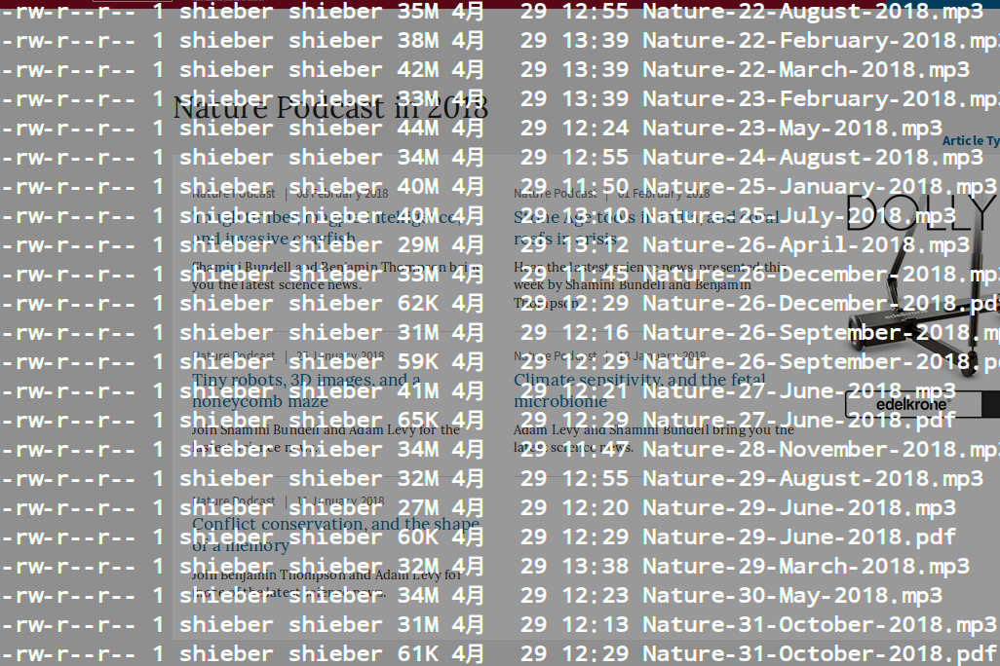

-------------
# Description #
-------------

<li><a href="README_CN.md">中文版</a></li>

Download all scientific podcasts and related transcripts(PDF version) from the very famous and import website:[Nature](https://www.nature.com/)

All Podcasts and pdf files will be stored in dirs like Nature20xx/ as time goes by.

# Usage #
	$ python NatureSpider.py

	Note: the python3 is required, and the latex and pandoc are also required.

# Result #
	

# Licence #

    Licensed under the Apache License, Version 2.0 (the "License"); you may
    not use this file except in compliance with the License. You may obtain
    a copy of the License at

         http://www.apache.org/licenses/LICENSE-2.0

    Unless required by applicable law or agreed to in writing, software
    distributed under the License is distributed on an "AS IS" BASIS, WITHOUT
    WARRANTIES OR CONDITIONS OF ANY KIND, either express or implied. See the
    License for the specific language governing permissions and limitations
    under the License.
	
